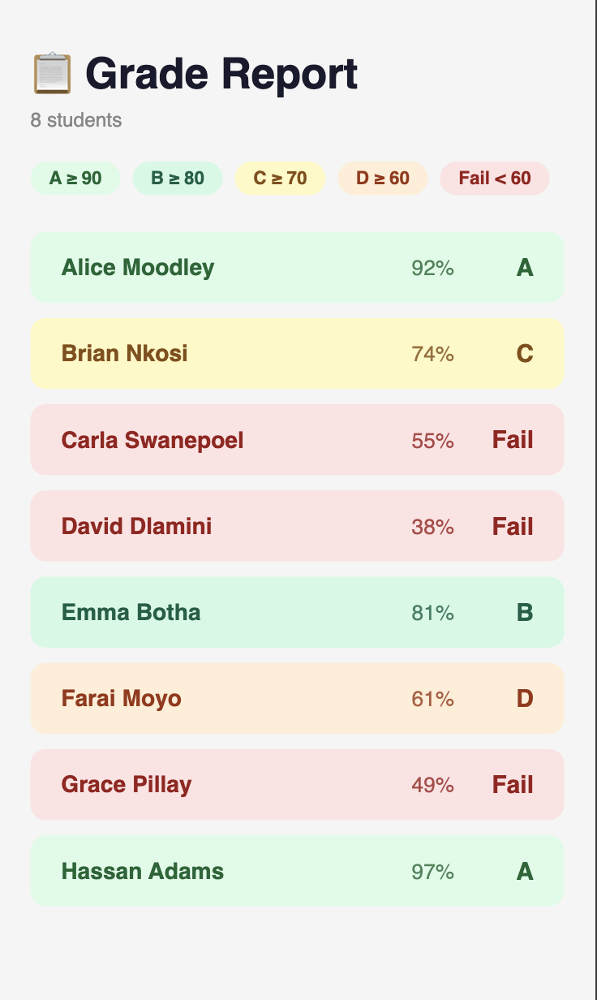
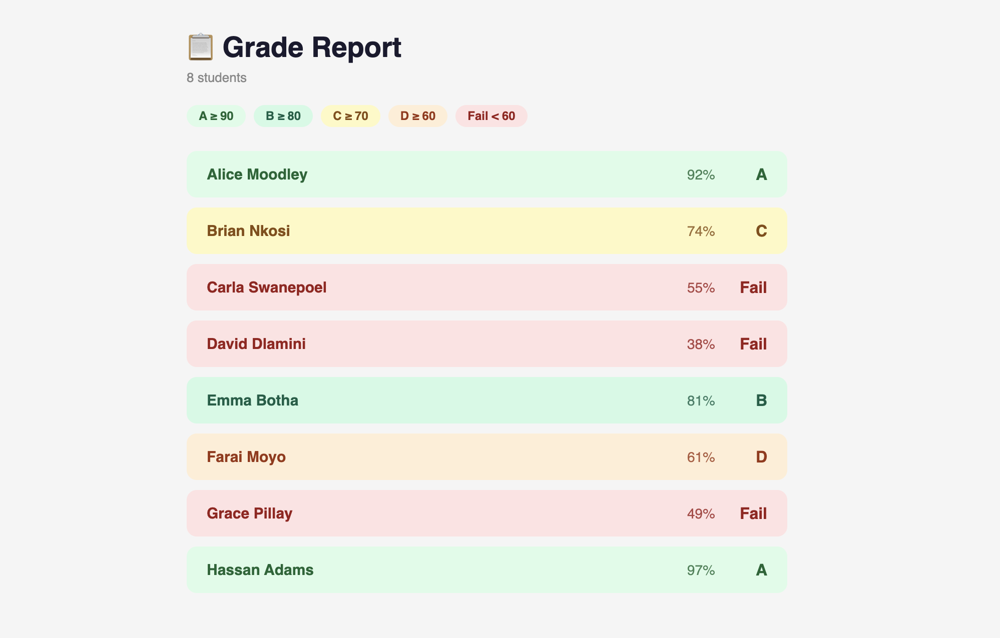

# 📊 Grade Report Card

A simple React + TypeScript application that renders a list of student scores and visually represents their grades using color indicators.

---

## 📖 Description

This application displays an array of students and their scores.  
Each grade is visually highlighted:

- 🟢 **Green** → Grade A  
- 🟡 **Yellow** → Grade B  
- 🔴 **Red** → Fail  

The goal of this project is to practice:
- TypeScript types
- Component structure
- Utility functions
- Conditional styling

---

## 🖥 Tech Stack

- React
- TypeScript
- JavaScript (ES6 Modules)
- HTML5
- CSS3

---

## 📂 Project Structure

```
GRADE-REPORT-CARD/
│
├── public/
│
├── src/
│   ├── assets/
│   │   └── screenshots/
│   │
│   ├── components/
│   │   └── studentRow.ts
│   │
│   ├── data/
│   │   └── student.ts
│   │
│   ├── utils/
│   │   └── gradeHelper.ts
│   │
│   ├── App.tsx
│   ├── App.css
│   ├── main.tsx
│   ├── main.ts
│   └── styles.css
│
├── package.json
└── README.md
```

### Folder Responsibilities

- **components/** → UI components  
- **data/** → Student data models  
- **utils/** → Grade calculation logic  
- **assets/** → Static files and screenshots  

---

## 📸 Screenshots

### 📱 Mobile View


### 💻 Desktop View


> Make sure your screenshots are stored inside:
> `src/assets/screenshots/`

---

## ⚙ Installation & Setup

1. Clone the repository:
   ```bash
   git clone https://github.com/your-username/grade-report-card.git
   ```

2. Navigate into the project:
   ```bash
   cd grade-report-card
   ```

3. Install dependencies:
   ```bash
   npm install
   ```

4. Start development server:
   ```bash
   npm run dev
   ```

---

## 🎯 What I Learned

- Structuring a React + TypeScript project
- Organizing project folders clearly

---

## 🚀 Future Improvements

- Add filtering by grade
- Add sorting by score
- Persist student data